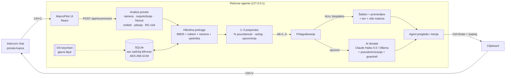

# MacroPilot – arhitektura

MacroPilot je lokalna aplikacija za jednog agenta korisničke podrške (iGaming / Stake.com). Agent nalepi poruku kupca,
aplikacija za delić sekunde preporuči 1–3 najbolja makroa sa procentom pouzdanosti i objašnjenjem, prilagodi
izabrani makro konkretnoj poruci, a agent jednim prečicom kopira odgovor i nalepi ga u Intercom.

Ovaj dokument opisuje **kako je sistem sastavljen i zašto**. Šema baze je u [SEMA-BAZE.md](SEMA-BAZE.md), promptovi u
[PROMPTOVI.md](PROMPTOVI.md), plan razvoja u [PLAN-FAZA.md](PLAN-FAZA.md).

---

## 1. Odluke na osnovu tvojih odgovora

| Zahtev | Odluka |
|---|---|
| Svaki agent koristi aplikaciju sam, hostuje se na računaru | Jedan proces (Node.js) na `127.0.0.1`, bez servera u oblaku, bez naloga. Za jedan folder sa podacima radi samo jedna instanca |
| Bez prijave – „upališ i koristiš“ | Nema logina. Umesto njega: ključ u OS keychain-u + pristupni token u linku koji otvara launcher (sekcija 6.3) |
| Samo engleski (Intercom prevodi) | Analiza i promptovi su na engleskom; prepoznaje se i upozorava kada poruka nije na engleskom |
| Bez Intercom integracije, samo clipboard | Kopiranje jednim tasterom (`Ctrl+Enter`), lepljenje bilo gde na stranici Assist (`Ctrl+V`), opcionalno automatsko čitanje clipboard-a |
| Makroi se iz Intercoma prenose ručno | Uvoz iz nalepljenog teksta, CSV-a i JSON-a, sa automatskom konverzijom Intercom promenljivih (`{{first_name \| fallback: "there"}}` → `{{user\|there}}`) |
| Što manje troškova | Sve osnovne funkcije rade **besplatno i lokalno**; AI je opcion (Claude Haiku 5.5 ≈ $2–3 mesečno za 150 poruka dnevno, ili Ollama besplatno) |
| „Ultra brzo“ | Preporuka bez AI-ja: analiza + pretraga na serveru 2–10 ms. UI šalje zahtev posle 120 ms debounce-a, pa se preporuke pojave oko 0,2 s posle lepljenja |
| Provera tačnosti na 2 dana | **Faza 3, još nije implementirano.** Tabele i podešavanja (podrazumevano uključeno, interval 48 h) već postoje, ali podešavanja još nemaju efekta. Planer sa nadoknadom propuštene provere pri pokretanju dolazi u Fazi 3 |
| Makroi šifrovani, čitljivi samo aplikaciji | AES-256-GCM za sav sadržaj, ključ u OS keychain-u, ključ za oporavak (sekcija 6) |

---

## 2. Tok: poruka → analiza → preporuka → prilagođavanje → agent → Intercom



Korak po korak:

1. **Unos.** Agent kopira poruku iz Intercoma i na stranici Assist pritisne `Ctrl+V` bilo gde van tekstualnih polja
   (ili `Ctrl+Shift+V` za čitanje clipboard-a). Sa drugih stranica prvo prelazi na Assist (`Alt+Shift+A`). Opciono se
   clipboard čita automatski kada se prozor fokusira.
2. **Analiza (lokalno, < 5 ms).** Deterministički analizator (`src/server/analysis`) prepoznaje:
   - **nameru** iz iGaming taksonomije od 21 kategorije (`withdrawal_pending`, `deposit_missing`, `bonus_inquiry`,
     `kyc_verification`, `responsible_gambling`, …),
   - **raspoloženje** (ljut, frustriran, zbunjen, neutralan, zadovoljan) i **hitnost** (niska … kritična),
   - **entitete**: mejl, korisničko ime, iznos + valuta, kripto valuta i mreža, tx hash, adresa novčanika, Bet ID,
     VIP rank, naziv bonusa, trajanje, datum, tip dokumenta, igra, provajder,
   - **sva pitanja** u poruci, svako sa svojom namerom (za odgovore na više pitanja),
   - **signale rizika od problematičnog kockanja** (npr. „lost everything“, „can't stop“). Kritični signali (samopovređivanje)
     dobijaju hitnost *critical* i crveno upozorenje agentu.
3. **Preporuka (cilj < 50 ms za 2.000 makroa).** Hibridni indeks u memoriji (`src/server/search`):
   - **leksički**: BM25 sa fuzzy i prefiks pretragom (MiniSearch), uz proširenje upita iGaming sinonimima
     (`cashout` → `withdrawal`, `rollover` → `wagering` …),
   - **semantički**: vektori (embeddings) naslova, primera pitanja i teksta makroa,
   - **namera**: poklapanje namera iz analize sa namerama makroa,
   - **upotreba**: omiljeni i često korišćeni makroi dobijaju blagu prednost.

   Rezultat je 1–3 makroa sa kalibrisanim procentom pouzdanosti, rečenicom „zašto“ i upozorenjem ako makro sadrži
   zastarele ili neproverene činjenice. Ako poruka ima dva različita pitanja, druga preporuka pokriva drugo pitanje,
   pa se oba makroa mogu **spojiti** u jedan odgovor. Ako ništa ne odgovara (ispod praga, podrazumevano 45%), UI to
   jasno kaže i nudi AI nacrt i čuvanje kao novog makroa.

   Opciono, kada je AI podešen, lokalni rezultat se posle prikaza proverava u pozadini (`POST /api/rerank`, „AI
   double-check of recommendations“, podrazumevano uključeno): AI ponovo oceni do 8 lokalnih kandidata, a kartice se
   ne preraspoređuju, nego im se samo ažuriraju procenat i razlog i označava „AI pick“. Za cloud AI se poruka
   pre slanja pseudonimizuje isto kao kod AI dorade, uključujući ime kupca koje je agent upisao. Ako agent promeni poruku, provera
   se prekida. Ako AI ne uspe, ostaje lokalni rezultat.
4. **Prilagođavanje.**
   - **Brzi režim (uvek, besplatno, < 5 ms):** popunjavanje promenljivih iz poruke i iz polja koja agent unese
     (`{{user}}`, `{{amount}}`, `{{crypto}}`, `{{tx_hash}}`, `{{vip_rank}}` …), pozdrav, rečenica prilagođena
     raspoloženju (izvinjenje ljutom kupcu, pojašnjenje zbunjenom), spajanje više makroa bez dupliranih pozdrava i
     završnica. Vrednosti koje zavise od pravila kompanije (`{{eta_time}}`, `{{bonus_amount}}`, `{{link}}`) **nikad**
     se ne uzimaju iz poruke kupca, nego ostaju kao jasno označen prazan prostor `[ENTER ETA TIME]`.
   - **AI režim (opciono):** model prepisuje odgovor tako da zvuči ljudski i odgovara na sva pitanja, **isključivo** na
     osnovu teksta makroa, proverenih činjenica i poruke. Pre slanja u oblak lični podaci se zamenjuju tokenima
     (`john@x.com` → `⟦EMAIL_1⟧`), a posle odgovora vraćaju lokalno (šta se sve prepoznaje: sekcija 7). Guardrail
     proverava svaki broj, procenat, rok i link u AI odgovoru. Ako se ne nalazi u izvorima, agent dobija upozorenje.
5. **Agent** vidi tekst, listu preostalih praznih mesta, upozorenja i menja šta želi. **Ništa se ne šalje kupcu
   automatski.**
6. **Kopiranje.** `Ctrl+Enter` kopira odgovor u clipboard. Ako su ostala prazna mesta, prvi pritisak upozori, a drugi
   kopira. Beleži se anonimni događaj za analitiku: koji makro, koliko je tekst izmenjen, bez teksta poruke. Brojač
   korišćenja makroa se posle toga uveća lokalno u UI-ju, bez ponovnog učitavanja biblioteke.

### Budžet latencije

| Korak | Cilj | Kako |
|---|---|---|
| Analiza | < 5 ms | prekompajlirani regex-i, bez mreže |
| Upit → vektor | < 1 ms (builtin) / ~10–30 ms (lokalni neuralni model) | model u istom procesu |
| Pretraga 2.000 makroa | < 50 ms | sve u memoriji (dešifrovano pri startu), BM25 + kosinus nad Float32Array |
| Analiza + pretraga, izmereno | 2–10 ms | `npm run eval` nad 60 demo makroa: prosek 2–3 ms, p95 ispod 10 ms |
| Od lepljenja do prikaza u UI-ju | ~0,2 s | zahtev ide posle 120 ms debounce-a (isti put i za kucanje), pa mrežni krug i prikaz |
| Brzo prilagođavanje | < 5 ms | čiste funkcije |
| Lista makroa u Library | < 50 ms po tasteru | prikazuju se samo vidljivi redovi (oko 20–30 od 2.000) |
| AI dorada / AI provera (opciono) | ~1–3 s | Claude Haiku 5.5, `effort: low`. UI odmah prikazuje lokalni rezultat, a AI verziju kada stigne |

---

## 3. Komponente

```
src/
  shared/            Ugovor između servera i UI-ja (tipovi, API rute, šablon-engine, verifikacija)
  server/
    index.ts         Start: konfiguracija, jedna instanca, slobodan port, ispis i otvaranje pristupnog linka
    instanceLock.ts  Jedna instanca po folderu sa podacima (`macropilot.lock`)
    bootstrap.ts     Povezivanje svih delova (ključ → baza → servisi → HTTP)
    config.ts        Putanje po OS-u (podaci i ključ u RAZLIČITIM folderima), dev režim
    recover.ts       `npm run recover` (ključ za oporavak se kuca bez prikaza, promptSecret.ts)
    crypto/          AES-256-GCM (cipher), keychain/fajl (keystore), ključ za oporavak, šifrovani backup
    db/              SQLite šema, migracije, repozitorijumi (jedino mesto sa SQL-om, sve šifruje)
    domain/          iGaming rečnik: koncepti/sinonimi, VIP rangovi, kripto/fiat aliasi, RG fraze
    analysis/        Lokalni analizator poruke
    search/          Embedderi (builtin / transformers / ollama) + hibridni indeks makroa
    personalize/     Brzo prilagođavanje, ton, spajanje, guardrail, pseudonimizacija + PII skener (piiScrubber.ts)
    ai/              Claude/Ollama provajderi, promptovi (zod šeme), AiService (budžet, privatnost)
    importexport/    Uvoz CSV/JSON/teksta (Intercom konverzija), izvoz
    services/        LibraryService (keš + indeks u sinhronizaciji), AssistService, SecurityService (ključ za
                     oporavak, pristupni token)
    api/app.ts       Fastify rute + lokalna zaštita (Host/Origin/pristupni token), CSP
  web/               React UI: Assist, Library, Import/Export, Settings, Ctrl+K pretraga; access.ts čuva token
seed/                Demo makroi zasnovani na javnom Stake Help Centru (proverene činjenice + izvori), eval skupovi
scripts/             launch.mjs (instalacija, build, start), eval preporuka, e2e test, generator PROMPTOVI.md
```

---

## 4. Tehnologije i zašto (u odnosu na predlog)

| Predlog | Izabrano | Obrazloženje |
|---|---|---|
| Node.js (TS) ili Python | **Node.js 22 + TypeScript** svuda | Jedan jezik i deljeni tipovi za server i UI. Node 22 ima ugrađen SQLite (`node:sqlite`), pa nema nativnih modula za kompajliranje na računaru agenta |
| PostgreSQL + pgvector | **SQLite (ugrađen u Node) + vektori u memoriji** | Aplikacija je za jednog korisnika na jednom računaru. Postgres bi agent morao da instalira i održava. Sa nekoliko stotina do par hiljada makroa pretraga svih vektora u memoriji traje manje od milisekunde, pa vektorska baza nije potrebna. SQLite je jedan fajl, transakcioni, i lako se šifruje na nivou polja. Za timsku verziju u budućnosti šema se lako prenosi na Postgres + pgvector |
| BullMQ / Celery | **Planer u istom procesu** (tabela `jobs`, Faza 3) | Nema Redisa ni workera. Tabela postoji, a planer još nije implementiran. U Fazi 3 će proveru na 2 dana pokretati tajmerom i nadoknađivati propuštenu proveru pri sledećem pokretanju. Sada u procesu radi samo brisanje stare analitike na 6 h |
| React | **React 19 + Vite** | Brz razvoj i mali bundle. Nema teških UI biblioteka, pa je interfejs brz |
| Intercom Canvas Kit | **Clipboard** (tvoj zahtev) | Inbox aplikacija nije potrebna. Opcija za kasnije je opisana u PLAN-FAZA.md |
| LLM preko API-ja | **Opciono:** Claude Haiku 5.5 ili Ollama | Osnovna vrednost (preporuka + šablon) ne zavisi od AI-ja. AI se uključuje u podešavanjima, uz mesečni limit troška |
| Model za embeddings | **3 opcije, automatski izbor** | `builtin`: bez zavisnosti, uvek radi. `transformers`: lokalni bge-small-en-v1.5 (~35 MB, preuzima se jednom sa Hugging Face-a). `ollama`: nomic-embed-text, samo kada je Ollama na ovom računaru (`localhost`, `127.x`, `::1`). Za Ollama adresu na drugom računaru koristi se `builtin`, jer embeddings vide svaku poruku i celu biblioteku bez pseudonimizacije. Sve besplatno i lokalno |

### Koliko košta AI (ako ga uključiš)

| Opcija | Cena | Kvalitet / brzina | Privatnost |
|---|---|---|---|
| **Isključeno** (podrazumevano) | $0 | Preporuke i šablon rade odmah. Nema „ljudskog“ preformulisanja | Ništa ne izlazi sa računara |
| **Claude Haiku 5.5** (preporuka) | $0,10 / 1M ulaznih i $0,50 / 1M izlaznih tokena. AI dorada je ≈ 1.500 ulaznih + ≈ 400 izlaznih tokena, oko **$0,0004** po odgovoru. AI provera preporuka (podrazumevano uključena, za svaku novu poruku) je oko **$0,0002–0,0003** po poruci. Za 150 poruka dnevno to je oko **$2–3 mesečno** sa oba, ili oko $1 samo sa proverom | Odličan, ~1–2 s | Šalje se samo tekst sa tokenima umesto ličnih podataka. Postoji limit mesečnog troška (podrazumevano $5) |
| **Ollama** (lokalni model, npr. `qwen2.5:3b`) | $0 | Solidan. Na običnom laptopu bez GPU-a 5–20 s po odgovoru | Ništa ne izlazi sa računara. Ollama na drugom računaru se tretira kao cloud: pseudonimizacija, a „Strogo lokalno“ je blokira |

Provera tačnosti na 2 dana (Faza 3) slaće AI-ju samo činjenice čiji se izvor promenio. Procena je manje od $0,10
mesečno.
Besplatne nivoe nekih cloud provajdera ne preporučujem za poruke kupaca, jer njihovi uslovi često dozvoljavaju
korišćenje podataka za poboljšanje proizvoda.

---

## 5. Biblioteka makroa i činjenice

- Makro ima naslov, tekst sa promenljivama (`{{user}}`, `{{user|there}}` sa rezervnom vrednošću), kategoriju, tagove,
  namere, **primere pitanja kupaca** (poboljšavaju semantičko poklapanje), internu belešku i kratku šifru za brzu
  pretragu.
- Svaka izmena sadržaja makroa (naslov, tekst, kategorija, tagovi, namere, primeri, beleška, šifra) pravi **novu
  verziju**. Ako se sadržaj nije promenio, verzija se ne pravi. Vraćanje na staru verziju pravi novu verziju sa starim
  sadržajem, pa se istorija nikad ne briše.
- **Činjenice se ne verzionišu.** Menjaju se na mestu, a vraćanje na staru verziju vraća samo sadržaj, ne i stare
  činjenice. Zato uvoz sa opcijom „Save as new version“ zadržava postojeće činjenice kada ih uvoz ne sadrži.
- **Činjenice** su atomske tvrdnje iz makroa (`ključ`, `tvrdnja`, `vrednost`, `link izvora`, `citat dokaza`, `status`).
  Status makroa se računa iz statusa činjenica: *verified*, *unverified*, *outdated* ili *conflict*. Makro sa
  zastarelom ili kontradiktornom činjenicom dobija vidljivo upozorenje kad se preporuči.

---

## 6. Šifrovanje: predlog i odgovor na dilemu „šifrovanje vs. provera tačnosti“

### 6.1 Šta se šifruje

**Sav korisnički sadržaj**: makroi i sve njihove verzije, činjenice, kategorije, podešavanja, API ključ, analitički
događaji, keš sadržaja izvora i **vektori (embeddings)**. Vektori se šifruju jer se iz njih delimično može
rekonstruisati tekst. Nešifrovano ostaju samo ID-jevi, vremena, brojači i statusi.

- Algoritam: **AES-256-GCM** (autentifikovano šifrovanje). Svaka vrednost ima svoj slučajni nonce.
- AAD vezuje svaku šifrovanu vrednost za njen red (npr. `facts:<id>`). Vrednost prekopirana u drugi red se ne može
  dešifrovati.
- Iz glavnog ključa se preko HKDF-a izvode podključevi: jedan za šifrovanje, jedan za HMAC „otiske“ sadržaja (keš,
  detekcija promena), tako da ni otisci ništa ne otkrivaju bez ključa, i jedan za pristupni token lokalnog API-ja
  (sekcija 6.3).
- Oštećen šifrovan red se preskače umesto da zaustavi aplikaciju: makro čija trenutna verzija ne može da se dešifruje
  se ne prikazuje, a nečitljiva stara verzija, činjenica ili kategorija se izostavlja. Ostatak biblioteke, pretraga i
  izvoz rade normalno. Pogrešan ključ se i dalje otkriva pri startu (šifrovani „kanarinac“ `key_check`).

### 6.2 Gde je ključ

- Glavni ključ (256 bita, slučajan) se pravi pri prvom pokretanju i čuva u **OS keychain-u**: Windows Credential Manager,
  macOS Keychain ili Linux Secret Service. Ako keychain nije dostupan, čuva se u zaštićenom fajlu (`0600`) u
  **drugom folderu** od baze.
- Posledica: ako baza ili backup **završe na internetu, bez ključa su neupotrebljivi.** Kopija foldera sa podacima ne
  sadrži ključ.
- **Ključ za oporavak** (`MPRK-XXXX-…`, 160 bita) prikazuje se pri prvom pokretanju i treba ga sačuvati u password
  manager. Njime se:
  - vraća pristup ako se keychain izgubi (`npm run recover`),
  - otvara šifrovani backup (`.mpbackup`) na drugom računaru.
- Dok ne potvrdiš da si ga sačuvao, ključ za oporavak stoji samo šifrovan u bazi, a posle potvrde se briše.
- `npm run recover` traži ključ za oporavak bez prikaza unosa u terminalu.
- **Novi ključ za oporavak** (Settings → Security) ponovo šifruje **isti** glavni ključ novim ključem za oporavak:
  - `npm run recover` i novi backup-ovi traže novi ključ,
  - stariji backup-ovi i stare kopije foldera sa podacima i dalje se otvaraju starim ključem,
  - zato ne štiti od starog ključa koji je već procureo: stari ključ i stari backup otkrivaju glavni ključ, a on
    otvara i kasnije backup-ove. Ako se to desi, napravi nov backup i obriši stare backup-ove i kopije foldera,
  - novi ključ ostaje šifrovan u bazi kao „na čekanju“ i može ponovo da se prikaže dok ga ne potvrdiš, isto kao ključ
    sa prvog pokretanja. Tek potvrda (`POST /api/security/recovery-key/ack`) ga briše.

### 6.3 „Bez prijave“, a ipak bezbedno

Server sluša samo na `127.0.0.1` i odbija:
- zahteve sa tuđim `Host` zaglavljem (štiti od DNS-rebinding napada sa zlonamernih sajtova),
- API zahteve sa tuđim `Origin` zaglavljem,
- API zahteve bez ispravnog pristupnog tokena u zaglavlju `X-MacroPilot` (odgovor 403 „Missing or invalid access
  token“). Token je HMAC-SHA256 nad `macropilot-access-v1` sa HKDF podključem glavnog ključa (`access`), u base64url
  obliku. Isti je pri svakom pokretanju, a može da ga izračuna samo neko ko može da pročita glavni ključ (keychain ili
  fajl ključa ovog OS korisnika). Zato ga ne mogu dobiti tuđi sajtovi ni drugi korisnici istog računara (RDS, Citrix,
  deljeni Linux server). Tuđi sajt ne može ni da pošalje sopstveno zaglavlje bez CORS dozvole, a server je nikad ne
  daje. Poređenje je otporno na merenje vremena (`timingSafeEqual`).

Da li je zahtev API zahtev, odlučuje se po ruti koju je ruter prepoznao i po dekodiranoj putanji, pa ni
`/%61pi/...` ne zaobilazi proveru. Putanja koja ne može da se dekodira tretira se kao API zahtev.

**Kako UI dobija token:** server ispisuje, a launcher otvara link `http://localhost:<port>/#/assist?k=<token>`. Token
je u fragmentu (`#…`), koji browser nikad ne šalje serveru. UI (`src/web/access.ts`) ga upiše u localStorage
(`macropilot.access`), ukloni iz adresne linije i šalje uz svaki API zahtev i preuzimanje fajla. Ako server odbije
token, umesto aplikacije se prikazuje samo ekran „Open MacroPilot from the launcher (MacroPilot.cmd / macropilot.sh) or
use the link shown in its console window“. U `npm run dev` režimu server ispisuje i Vite link sa tokenom
(`http://localhost:5173/#/assist?k=…`).

**Jedna instanca:** server drži `<folder sa podacima>/macropilot.lock` (PID, port, vreme pokretanja, nikad token),
napravljen atomično i ekskluzivno, sa dozvolama `0600`. Drugo pokretanje proveri `/api/health` na tom portu sa
tokenom. Ako MacroPilot odgovori, ispiše i otvori njegov link i završi se. Dok se prva instanca još pokreće, drugo
pokretanje je čeka. Zaključavanje je zastarelo, pa se zamenjuje, kada proces više ne postoji ili kada se niko ne javi
ni posle 60 s. Tako dve instance nikad ne rade nad istom bazom sa različitim kešovima u memoriji.

UI ima strogi Content-Security-Policy, bez spoljnih skripti.

### 6.4 Da li šifrovanje sprečava proveru tačnosti? Ne.

Provera tačnosti radi **unutar aplikacije**, koja ima ključ. Činjenice se dešifruju samo u memoriji, upoređuju sa
izvorima i rezultat se ponovo šifrovan upisuje u bazu. Predloženi tok (Faza 3) minimizuje šta uopšte napušta računar:

1. **Izvori se samo preuzimaju.** Stake Help Center je javan. Confluence i Google Docs se čitaju tvojim tokenom. Ništa se
   ne šalje izvoru.
2. **Deterministička provera, lokalno i besplatno.** Izvor se deli na pasuse i za svaki se računa HMAC otisak.
   - Ako se pasus koji dokazuje činjenicu nije promenio od poslednje provere, činjenica ostaje *verified* bez ikakvog
     AI-ja. To je velika većina slučajeva.
   - Ako se promenio, lokalno se upoređuju brojevi, procenti, rokovi i linkovi. Jasno poklapanje ili jasna razlika
     rešavaju se bez AI-ja.
3. **AI samo za dvosmislene slučajeve.** Šalje se jedna činjenica i relevantni javni pasus, a nikad cela biblioteka,
   tekst makroa ili podaci kupaca. U režimu „Strogo lokalno“ koristi se Ollama ili se dvosmislene činjenice
   označavaju za ručnu proveru.
4. **Predlog izmene** (staro/novo sa linkom ka izvoru) čeka tvoje odobrenje i tek tada postaje nova verzija makroa.

Zaključak: **šifrovanje štiti podatke na disku i u backup-ovima, a provera radi nad dešifrovanim podacima u memoriji.**
Ograničenje, isto kao kod svake aplikacije: neko ko ima pristup tvom uključenom računaru pod tvojim nalogom, kao i
svaki program pokrenut pod tim nalogom, može da pročita ključ i da koristi aplikaciju. Drugi OS korisnici ne mogu.
Ako ti to bude potrebno, kasnije se može dodati opciona lozinka pri pokretanju.

---

## 7. Privatnost i GDPR

- **Poruke kupaca se ne čuvaju.** Obrađuju se u memoriji tokom jednog zahteva. U bazu se ne upisuju, a server ih ne
  loguje.
- Analitički događaji sadrže samo ID makroa, nameru, pouzdanost i koliko je tekst izmenjen, bez teksta. Šifrovani su i
  automatski se brišu posle 90 dana (podesivo).
- Pre slanja AI-ju u oblaku (AI dorada, nacrt i AI provera preporuka) lični podaci se **pseudonimizuju** i vraćaju tek
  lokalno. Podešavanje „Pseudonymize personal data“ je podrazumevano uključeno. Tokeni se prave za:
  - entitete analizatora: mejl, korisničko ime, telefon, tx hash, adresa novčanika, Bet ID i ime („my name is …“,
    „this is … here“, potpis na kraju poruke),
  - nalaze ugrađenog PII skenera (`src/server/personalize/piiScrubber.ts`): ime koje se kupac predstavlja („I'm …“,
    „I am …“, „It's …“, „… here“, „Name: …“, „call me …“), IBAN, broj kartice (Luhn), datum rođenja, broj pasoša,
    lične karte ili drugog dokumenta, adresu stanovanja i telefon,
  - vrednosti koje je agent upisao (ime kupca kao `user`, mejl, korisničko ime …).

  Tokeni: `⟦EMAIL_n⟧`, `⟦NAME_n⟧`, `⟦USERNAME_n⟧`, `⟦PHONE_n⟧`, `⟦TX_HASH_n⟧`, `⟦ADDRESS_n⟧` (adresa novčanika i adresa
  stanovanja), `⟦BET_ID_n⟧`, `⟦IBAN_n⟧`, `⟦CARD_n⟧`, `⟦DOB_n⟧`, `⟦DOC_ID_n⟧`. Iznosi i valute ostaju čitljivi.

  **Ograničenja:** ime napisano samo malim ili samo velikim slovima („im jovana“, „I AM JOVANA“), mesec kao ime („I'm
  April“) i ime treće osobe („my brother Marko“) se ne prepoznaju. Ime koje agent upiše maskira se samo u istom obliku
  (velika i mala slova se razlikuju). Maskira se po vrednosti, pa prepoznato ime „Will“ postaje token i u „Will I get my
  money?“, ali se u odgovoru vraća.
- „Strogo lokalno“ režim (Settings → Privacy) zabranjuje AI pozive van ovog računara: Claude i Ollama na drugom
  računaru. Ollama embeddings se ionako koriste samo sa Ollama-om na ovom računaru, bez obzira na ovaj režim. Jedini
  mrežni zahtev koji ostaje je jednokratno preuzimanje lokalnog modela za pretragu (`bge-small-en-v1.5`) sa Hugging
  Face-a u režimu `auto`/`transformers`, bez ikakvih podataka iz aplikacije.
- API ključ se čuva šifrovan u bazi, nikad u frontend kodu, i UI ga nikad ne dobija nazad.
- Pošto aplikacija ne čuva lične podatke kupaca, nema šta da se briše na zahtev kupca. To bitno pojednostavljuje GDPR.

---

## 8. Odgovorno kockanje (iGaming specifičnosti)

- Detekcija RG signala, crveni baner i hitnost *critical* za signale samopovređivanja.
- AI promptovi zabranjuju podsticanje kockanja i depozita, obećavanje dobitaka, rokova isplate ili bonusa koji nisu u
  izvorima, kao i pravne i poreske savete.
- U RG slučajevima ton je smiren, bez veselih fraza, a agent dobija belešku da sledi internu RG proceduru.

---

## 9. Proširivost

- Novi izvor istine je nova vrsta u tabeli `sources` plus funkcija koja vraća tekst izvora.
- Novi AI provajder implementira interfejs `LlmProvider`.
- Novi embedder implementira interfejs `Embedder`.
- Za timsku verziju: šema se prenosi na Postgres + pgvector, LibraryService postaje deljeni servis, a lokalni
  keychain zamenjuje KMS.
