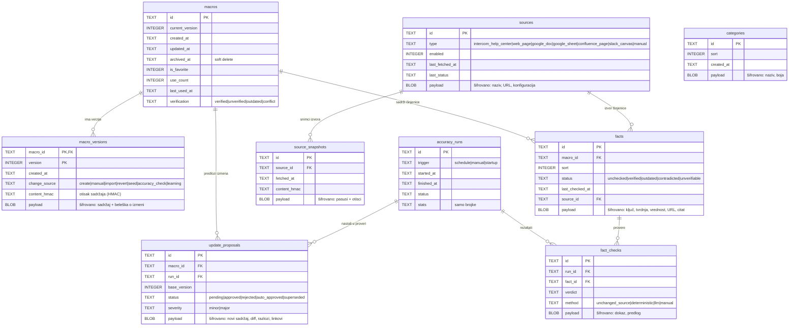

# MacroPilot – šema baze podataka

Baza je jedan SQLite fajl (`macropilot.db`) u folderu sa podacima. Koristi se Node-ov ugrađeni `node:sqlite`, sa WAL
režimom i stranim ključevima. Izvorna definicija je u [`src/server/db/schema.ts`](../src/server/db/schema.ts), a migracije se
primenjuju automatski pri pokretanju.

**Pravilo šifrovanja:** svaka kolona `payload` sadrži AES-256-GCM blob:
`[verzija 1B][nonce 12B][šifrovani tekst][tag 16B]`. Nešifrovano su samo ID-jevi, vremena, brojači i enumi. AAD
(dodatni autentifikovani podaci) vezuje blob za njegov red, pa se šifrovana vrednost ne može premestiti u drugi red.

## Tabele

### Biblioteka (Faza 1)

| Tabela | Svrha | Šifrovano (`payload`) |
|---|---|---|
| `macros` | Jedan red po makrou: trenutna verzija, omiljen, broj i vreme korišćenja, zbirni status provere, arhiviran | – (samo metapodaci) |
| `macro_versions` | Kompletna istorija sadržaja. Svaka izmena je nova verzija. Revert pravi novu verziju sa starim sadržajem | `{content: {title, body, categoryId, tags, intents, triggers, notes, shortcut}, changeNote}` |
| `facts` | Atomske činjenice makroa i njihov status | `{key, statement, value, sourceUrl, evidenceQuote}` |
| `categories` | Kategorije makroa | `{name, color}` |
| `settings` | Podešavanja (`app`) i tajne (`secret:anthropic_api_key`, privremeno `secret:pending_recovery_key`) | ceo JSON |
| `meta` | Verzija šeme, `key_check` (šifrovani kanarinac za proveru ključa), `recovery_wrapped` (glavni ključ šifrovan ključem za oporavak), `recovery_ack`, `seeded` | `key_check` je šifrovan. `recovery_wrapped` je šifrovan ključem za oporavak (scrypt + AES-GCM) |
| `embeddings` | Keš vektora po `(model, content_hmac)`, da se pri startu ništa ne računa ponovo | bajtovi vektora |
| `events` | Anonimna analitika: prikazano, izabrano, kopirano, bez poklapanja. **Nikad tekst poruke** | `{type, macroIds, rank, confidence, intents, editRatio, mode}` |
| `llm_usage` | Potrošnja tokena i trošak po mesecu (za limit budžeta) | – (samo brojke) |

### Provera tačnosti (Faza 3, tabele postoje od početka da se šema ne menja)

| Tabela | Svrha |
|---|---|
| `sources` | Povezani izvori istine: Help Center, stranice sajta, Google Docs/Sheets, Confluence, Slack canvas, ručno unete činjenice |
| `source_snapshots` | Poslednji snimci izvora podeljeni na pasuse sa HMAC otiscima. Nepromenjen pasus znači da proveru nije potrebno ponavljati |
| `accuracy_runs` | Svako pokretanje provere: zakazano, ručno ili nadoknada pri startu |
| `fact_checks` | Rezultat po činjenici: presuda, metod (nepromenjen izvor, deterministički, LLM, ručno) i dokaz |
| `update_proposals` | Predlozi izmena makroa (staro/novo, razlozi, linkovi) koji čekaju odobrenje |
| `jobs` | Raspored: `accuracy_check` sa intervalom od 48 h, `next_run_at`, `last_run_at` |

## AAD konvencije

| Tabela | AAD |
|---|---|
| categories | `categories:<id>` |
| macro_versions | `macro_versions:<macro_id>:<version>` |
| facts | `facts:<id>` |
| settings | `settings:<key>` |
| embeddings | `embeddings:<model>:<content_hmac>` |
| events | `events:<uid>` |
| sources / source_snapshots / fact_checks / update_proposals | `<tabela>:<id>` |
| meta key_check | `meta:key_check` |

## Zadržavanje podataka

- Poruke kupaca se **ne upisuju nikad**.
- `events` se brišu posle `privacy.analyticsRetentionDays` (podrazumevano 90), pri startu i na svakih 6 sati.
- Verzije makroa se čuvaju trajno, jer su istorija izmena. Trajno brisanje makroa briše i njegove verzije i činjenice
  (`ON DELETE CASCADE`).
- Šifrovani backup (`.mpbackup`) sadrži izvoz biblioteke i glavni ključ zaštićen ključem za oporavak.
